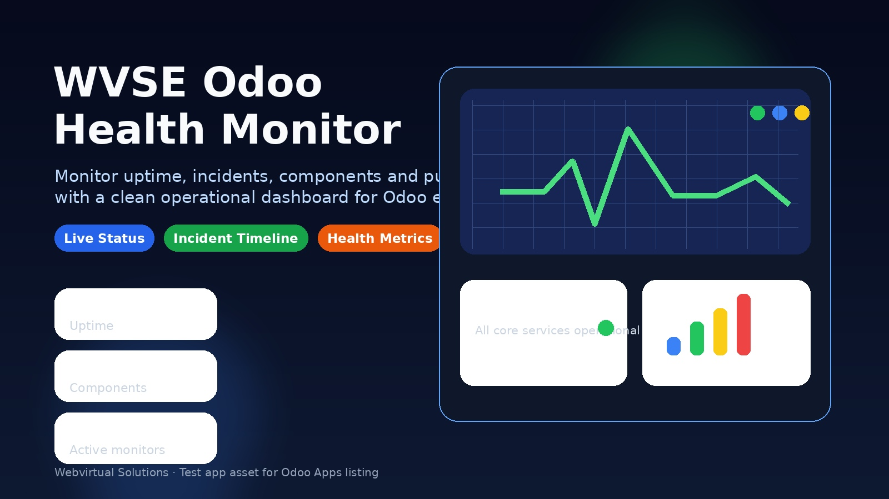
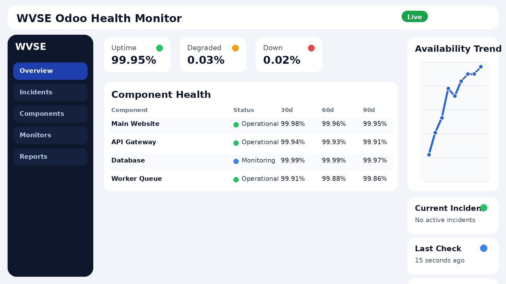

# Webvirtual Health Monitor

    

> Short business summary of the Webvirtual Health Monitor main features.



## Marketplace Assets

### Icon


### Screenshots



## Overview

Daily health checks and safe self-healing for timesheets and attendance
================

Overview
--------
Complete business module for Odoo with backend logic, security rules,
scheduled jobs, reports, portal/website integration, frontend assets,
and automated tests.

Main Features
-------------
- Business model management
- Access rights and record rules
- Menus, actions, views, dashboards
- Wizards and reports
- Scheduled jobs
- Email templates and automated actions
- Website / portal integration
- JavaScript / OWL / SCSS assets
- Demo data and automated tests
- Upgrade scripts support

Technical Notes
---------------
- Compatible with custom deployments on Community and On-Premise
- Published on Odoo Apps
- Use Community or Enterprise depending on declared dependencies

## Module Snapshot

| Field | Value |
|---|---|
| Display Name | Webvirtual Health Monitor |
| Technical Name | `wvse_odoo_health_monitor` |
| Version | 15.0.1.1.0 |
| Summary | Short business summary of the Webvirtual Health Monitor main features. |
| Category | Tools |
| License | OPL-1 |
| Author | Webvirtual Soluções Empresariais |
| Maintainer | Webvirtual |
| Website | https://www.webvirtual.com.br |
| Support | odoo@webvirtual.com.br |
| Live Test URL | https://15.odoo.webvirtual.com.br |
| Installable | Yes |
| Application | Yes |
| Auto Install | No |
| Price | 1.49 |
| Currency | USD |

## Key Capabilities

- Backend models and ORM business logic
- HTTP controllers and route handling
- Custom API endpoints
- Webhook integration endpoints
- Wizard and transient user flows
- Report templates and printing resources
- Access control and record security resources
- Menus, actions, forms, lists, searches, dashboards, and UI XML
- System configuration through Odoo settings
- Portal integration
- Website integration
- Frontend assets such as JavaScript, SCSS, CSS, XML, and images
- Automated testing scaffolding
- Translation and localization resources
- Demo data resources
- Versioned upgrade scripts
- Manifest dependencies: base, mail, project, hr_attendance, hr_timesheet

## Installation

1. Place the module folder inside the custom addons path used by your Odoo server.
2. Restart the Odoo service or Odoo process.
3. Open Apps and update the apps list.
4. Search for `wvse_odoo_health_monitor` or the module display name.
5. Install the module.
6. Review settings, security groups, menus, reports, and scheduled actions after installation.

### Command Line Example

```bash
odoo-bin -d <database_name> -i wvse_odoo_health_monitor --stop-after-init
```

## Update Guide

1. Back up the database before updating the module.
2. Replace or merge the new module source code carefully.
3. Restart the Odoo service.
4. Upgrade the module using `-u wvse_odoo_health_monitor` or through the Apps interface.
5. Validate views, security, reports, assets, and automation after the update.

### Command Line Example

```bash
odoo-bin -d <database_name> -u wvse_odoo_health_monitor --stop-after-init
```

## Dependencies

### Manifest Dependencies

- `base`
- `mail`
- `project`
- `hr_attendance`
- `hr_timesheet`

### External Dependencies

```python
{'python': [], 'bin': []}
```

## Frontend and Static Assets

```python
{
    'web.assets_backend': [
        'wvse_odoo_health_monitor/static/src/scss/variables.scss',
        'wvse_odoo_health_monitor/static/src/scss/backend.scss',
        'wvse_odoo_health_monitor/static/src/css/legacy.css',
        'wvse_odoo_health_monitor/static/src/js/backend.js',
        'wvse_odoo_health_monitor/static/src/js/fields/wvse_custom_field.js',
        'wvse_odoo_health_monitor/static/src/js/views/wvse_custom_view.js',
        'wvse_odoo_health_monitor/static/src/js/components/wvse_component.js',
        'wvse_odoo_health_monitor/static/src/js/components/wvse_dialog.js',
        'wvse_odoo_health_monitor/static/src/js/services/wvse_service.js',
        'wvse_odoo_health_monitor/static/src/js/patches/some_patch.js',
        'wvse_odoo_health_monitor/static/src/js/utils/helpers.js',
    ],
    'web.assets_frontend': [
        'wvse_odoo_health_monitor/static/src/scss/frontend.scss',
        'wvse_odoo_health_monitor/static/src/scss/portal.scss',
        'wvse_odoo_health_monitor/static/src/js/frontend.js',
        'wvse_odoo_health_monitor/static/src/js/portal.js',
    ],
    'website.assets_frontend': [
        'wvse_odoo_health_monitor/static/src/scss/website.scss',
        'wvse_odoo_health_monitor/static/src/js/website.js',
    ],
    'web.assets_qweb': [
        'wvse_odoo_health_monitor/static/src/xml/templates.xml',
        'wvse_odoo_health_monitor/static/src/xml/components.xml',
        'wvse_odoo_health_monitor/static/src/xml/dialogs.xml',
        'wvse_odoo_health_monitor/static/src/xml/qweb/common.xml',
        'wvse_odoo_health_monitor/static/src/xml/qweb/backend.xml',
        'wvse_odoo_health_monitor/static/src/xml/qweb/frontend.xml',
        'wvse_odoo_health_monitor/static/src/xml/qweb/portal.xml',
        'wvse_odoo_health_monitor/static/src/xml/qweb/website.xml',
    ],
    'web.qunit_suite_tests': [
        'wvse_odoo_health_monitor/static/tests/**/*.js',
    ],
}
```

## Repository Structure

### Main Sections

| Section | Present |
|---|---|
| `controllers` | Yes |
| `models` | Yes |
| `wizard` | Yes |
| `report` | Yes |
| `security` | Yes |
| `views` | Yes |
| `data` | Yes |
| `demo` | Yes |
| `i18n` | Yes |
| `tests` | Yes |
| `static/src` | Yes |
| `static/tests` | Yes |
| `doc` | Yes |
| `docs` | No |
| `migrations` | No |
| `upgrades` | Yes |

### File Extension Distribution

| Extension | Count |
|---|---:|
| `.css` | 2 |
| `.csv` | 1 |
| `.html` | 3 |
| `.jpg` | 2 |
| `.js` | 15 |
| `.md` | 2 |
| `.png` | 6 |
| `.po` | 3 |
| `.pot` | 1 |
| `.py` | 39 |
| `.rst` | 1 |
| `.scss` | 5 |
| `.svg` | 2 |
| `.txt` | 1 |
| `.xml` | 53 |
| `[no extension]` | 3 |

### Structure Tree

```text
wvse_odoo_health_monitor/
├── controllers
│   ├── __init__.py
│   ├── api.py
│   ├── main.py
│   ├── portal.py
│   └── webhook.py
├── data
│   ├── decimal_precision_data.xml
│   ├── ir_actions_server.xml
│   ├── ir_config_parameter.xml
│   ├── ir_cron_data.xml
│   ├── ir_sequence_data.xml
│   ├── mail_activity_type_data.xml
│   ├── mail_template_data.xml
│   ├── report_paperformat_data.xml
│   ├── web_tour_data.xml
│   ├── wvse_odoo_health_monitor_data.xml
│   ├── wvse_odoo_health_monitor_demo_bridge.xml
│   └── wvse_odoo_health_monitor_onboarding.xml
├── demo
│   ├── demo.xml
│   ├── demo_users.xml
│   └── wvse_model_demo.xml
├── doc
│   ├── structure
│   │   ├── manifest_reference.py
│   │   └── module_structure.txt
│   ├── index.rst
│   ├── README.md
│   └── viewer.html
├── i18n
│   ├── en_US.po
│   ├── es.po
│   ├── pt_BR.po
│   └── wvse_odoo_health_monitor.pot
├── models
│   ├── __init__.py
│   ├── abstract_models.py
│   ├── health_issue.py
│   ├── health_run.py
│   ├── health_settings.py
│   ├── hr_attendance_patch.py
│   ├── hr_employee_patch.py
│   ├── mail_thread_mixin.py
│   ├── res_company.py
│   ├── res_config_settings.py
│   ├── res_partner.py
│   ├── res_users.py
│   └── schedule_wizard.py
├── report
│   ├── __init__.py
│   ├── wvse_label_report.xml
│   ├── wvse_report.py
│   ├── wvse_report_actions.xml
│   ├── wvse_report_paperformat.xml
│   └── wvse_report_templates.xml
├── security
│   ├── ir.model.access.csv
│   ├── ir_rule.xml
│   ├── wvse_odoo_health_monitor_groups.xml
│   └── wvse_odoo_health_monitor_security.xml
├── static
│   ├── description
│   │   ├── images
│   │   │   ├── main-screenshot-1.png
│   │   │   ├── main-screenshot-2.png
│   │   │   ├── whatsapp.png
│   │   │   └── wvse_logo_horizontal_color.png
│   │   ├── docs.html
│   │   ├── icon.png
│   │   ├── index.html
│   │   ├── wvse_odoo_health_monitor_cover.jpg
│   │   └── wvse_odoo_health_monitor_screenshot.jpg
│   ├── src
│   │   ├── css
│   │   │   └── legacy.css
│   │   ├── img
│   │   │   ├── icons
│   │   │   ├── icon.svg
│   │   │   ├── illustration.png
│   │   │   └── logo.svg
│   │   ├── js
│   │   │   ├── components
│   │   │   │   ├── wvse_component.js
│   │   │   │   └── wvse_dialog.js
│   │   │   ├── fields
│   │   │   │   └── wvse_custom_field.js
│   │   │   ├── patches
│   │   │   │   └── some_patch.js
│   │   │   ├── services
│   │   │   │   └── wvse_service.js
│   │   │   ├── utils
│   │   │   │   └── helpers.js
│   │   │   ├── views
│   │   │   │   └── wvse_custom_view.js
│   │   │   ├── backend.js
│   │   │   ├── frontend.js
│   │   │   ├── portal.js
│   │   │   └── website.js
│   │   ├── lib
│   │   │   └── third_party_library
│   │   │       ├── lib.css
│   │   │       └── lib.js
│   │   ├── scss
│   │   │   ├── backend.scss
│   │   │   ├── frontend.scss
│   │   │   ├── portal.scss
│   │   │   ├── variables.scss
│   │   │   └── website.scss
│   │   └── xml
│   │       ├── qweb
│   │       │   ├── backend.xml
│   │       │   ├── common.xml
│   │       │   ├── frontend.xml
│   │       │   ├── portal.xml
│   │       │   └── website.xml
│   │       ├── components.xml
│   │       ├── dialogs.xml
│   │       └── templates.xml
│   └── tests
│       ├── helpers
│       │   └── test_helpers.js
│       ├── mock_server
│       │   └── mock_data.js
│       └── tours
│           └── wvse_odoo_health_monitor_tour.js
├── tests
│   ├── __init__.py
│   ├── common.py
│   ├── test_access_rights.py
│   ├── test_controllers.py
│   ├── test_flows.py
│   ├── test_models.py
│   ├── test_reports.py
│   ├── test_security.py
│   └── test_tours.py
├── upgrades
│   └── 15.0.1.0.0
│       ├── end-001-cleanup.py
│       ├── post-001-migrate.py
│       └── pre-001-prepare.py
├── views
│   ├── actions.xml
│   ├── assets.xml
│   ├── health_issue_views.xml
│   ├── health_run_views.xml
│   ├── menus.xml
│   ├── portal_templates.xml
│   ├── res_config_settings_views.xml
│   ├── schedule_wizard_views.xml
│   ├── snippets.xml
│   ├── website_templates.xml
│   ├── wvse_model_activity_views.xml
│   ├── wvse_model_calendar_views.xml
│   ├── wvse_model_cohort_views.xml
│   ├── wvse_model_dashboard_views.xml
│   ├── wvse_model_form_views.xml
│   ├── wvse_model_graph_views.xml
│   ├── wvse_model_kanban_views.xml
│   ├── wvse_model_pivot_views.xml
│   ├── wvse_model_search_views.xml
│   ├── wvse_model_tree_views.xml
│   └── wvse_model_views.xml
├── wizard
│   ├── __init__.py
│   ├── wvse_batch_wizard.py
│   ├── wvse_batch_wizard_views.xml
│   ├── wvse_wizard.py
│   └── wvse_wizard_views.xml
├── __init__.py
├── __manifest__.py
├── COPYRIGHT
├── hooks.py
├── LICENSE
├── NOTICE
└── README.md
```

## Deployment and Validation Guidance

- Custom modules should be validated in a staging database before production rollout.
- Always confirm that all declared dependencies are present in the target Odoo environment.
- This module depends on messaging features and should be validated with notifications, chatter, or templates.
- The manifest license indicates a proprietary distribution model.

## Functional and Technical Notes

- Directory count: **37**
- File count: **1**
- Review security rules, menus, actions, and reports after the first installation.
- Validate browser-side assets after installation or upgrade when the module contains static resources.
- Use a staging database before deploying changes to production.

## Support

- Company: **Webvirtual Soluções Empresariais LTDA**
- Brand: **Webvirtual**
- Website: https://www.webvirtual.com.br
- Support Email: odoo@webvirtual.com.br
- General Email: contato@webvirtual.com.br
- Phone 1: +55 31 97147-4489
- Phone 2: +55 62 99913-2635
- Address: Av Alameda dos Ipês, 8625 Sala 12-A - Vale Do Sereno, Belo Horizonte, Minas Gerais, 34012-970, Brasil

### Recommended Support Request Information

- Module technical name: `wvse_odoo_health_monitor`
- Module version: `15.0.1.1.0`
- Odoo version and edition
- Environment type: development, staging, or production
- Clear reproduction steps
- Expected behavior
- Actual behavior
- Relevant traceback or server logs
- Screenshots or screen recording when useful
- Browser console errors for frontend issues

## License and Legal

- This repository declares the license **OPL-1** in the Odoo manifest.
- Refer to the root `LICENSE`, `COPYRIGHT`, and `NOTICE` files for the legal distribution information maintained for this module.

## Maintained By

**Webvirtual**  
https://www.webvirtual.com.br  
odoo@webvirtual.com.br
